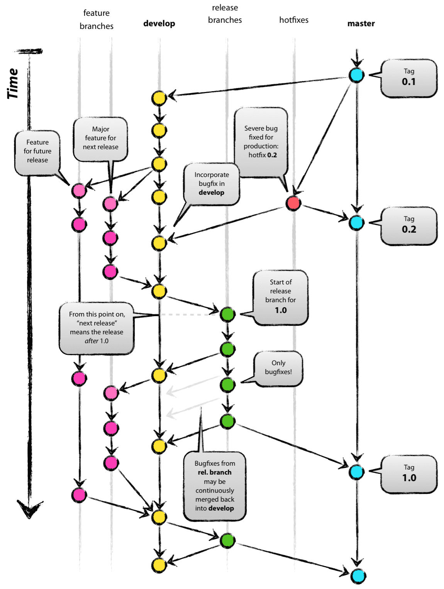

# Git Flow

1. main : 배포 가능한 상태만을 관리한다.
2. develop : 다음 출시 버전을 개발하는 브랜치다.
3. feature : 기능을 개발하는 브랜치다.
4. release : 이번 출시 버전을 준비하는 브랜치다.
5. hotfix : 출시 버전에서 발생한 버그를 수정하는 브랜치다.

# 전략

1. develop 브랜치를 만들어 신기능을 개발한다.

   1-1. 이 과정에서 develop 에도 웬만하면 직접적으로 커밋하지 않는다.

2. feature 브랜치를 만들어 신기능을 개발한다. (feature/기능이름)

   2-1. feature 브랜치는 develop 브랜치에서 분기한다.

   2-2. feature 브랜치는 develop 브랜치에 병합된다.

3. 기능 개발이 완료되면 release 브랜치를 만들어 출시 버전을 준비한다. (release/버전)

   3-1. release 브랜치는 develop 브랜치에서 분기한다.

   3-2. release 브랜치는 main 브랜치와 develop 브랜치에 병합된다.

4. 출시 버전에 버그가 있으면 hotfix 브랜치를 만들어 수정한다. (hotfix/버전)

   4-1. hotfix 브랜치는 main 브랜치에서 분기한다.

   4-2. hotfix 브랜치는 main 브랜치와 develop 브랜치에 병합된다.

# 주의 사항

1. main 브랜치는 직접적으로 수정하지 않는다.

